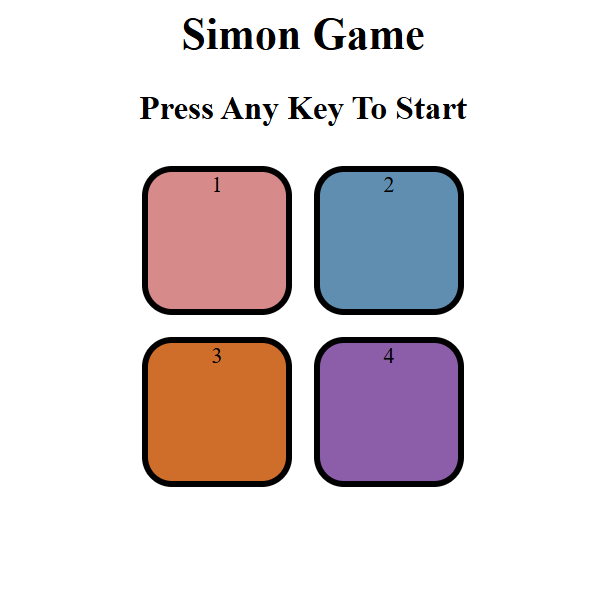
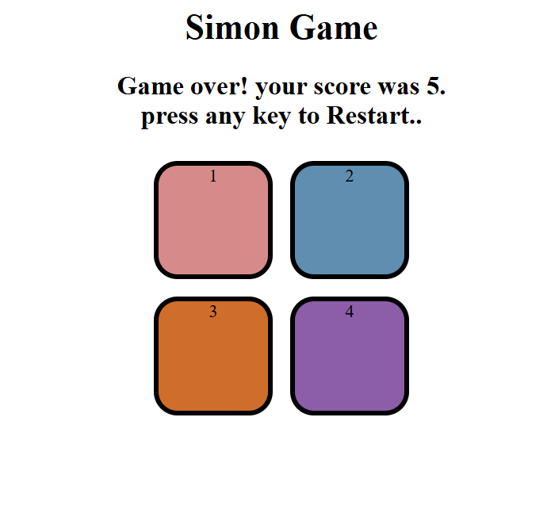

# 🎮 Simon Says Game

An interactive **Simon Says Game** built using **HTML, CSS, and JavaScript**. This project recreates the classic memory game where players must remember and repeat an increasingly long sequence of colored buttons.

It was developed to strengthen my understanding of JavaScript fundamentals, including DOM manipulation, event handling, arrays, functions, and game logic.

---

## 🚀 Live Demo

🌐  https://dharmeshchauhan112212-ux.github.io/Simon-Say-Game/

---

## 📸 Project Preview

### 🏠 Game Start Screen



### 💥 Game Over Screen



---

## 🎯 Features

* 🎮 Interactive Simon Says gameplay
* 🎨 Four colorful game buttons
* ✨ Button flash animations
* 🔀 Random sequence generation
* 📈 Progressive difficulty with each level
* ✅ Real-time user input validation
* 💥 Game Over detection
* 🔄 Restart game by pressing any key
* 💻 Clean and simple user interface

---

## 🕹️ How to Play

1. Press **any key** to start the game.
2. Watch the button that flashes.
3. Click the same button.
4. Each level adds a new color to the sequence.
5. Repeat the complete sequence correctly.
6. The game ends if you click the wrong button.
7. Press any key to restart and try to achieve a higher score.

---

## 🛠️ Built With

* HTML5
* CSS3
* JavaScript (ES6)

---

## 📁 Project Structure

```text
Simon-Says-Game/
│── index.html
│── style.css
│── app.js
│── README.md
└── images/
    ├── start-screen.png
    └── game-over.png
```

---

## 📚 What I Learned

During this project, I improved my understanding of:

* DOM Manipulation
* Event Handling
* JavaScript Arrays
* Functions
* Conditional Statements
* Game Logic
* CSS Styling & Animations
* Debugging and Problem Solving

---

## 🔮 Future Improvements

* 🏆 High Score using Local Storage
* 🔊 Sound effects for each button
* 📱 Fully responsive design
* 🌙 Dark Mode
* ▶️ Start button for mobile devices
* 🎵 Smooth animations and transitions

---

## 👨‍💻 Author

**Dharmesh Chauhan**

Aspiring Full Stack Web Developer passionate about creating interactive and user-friendly web applications.

* GitHub: https://github.com/dharmeshchauhan112212-ux
* LinkedIn: https://www.linkedin.com/in/dharmesh-chauhan-cte-gecbvn-ce-38ab2a353/

---

## ⭐ Support

If you found this project helpful or interesting, please consider giving it a ⭐ on GitHub.

Your feedback and suggestions are always welcome!

## 📜 License

This project is open-source and available under the **MIT License**.
